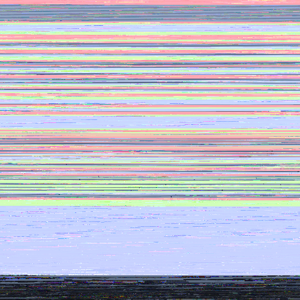

|Original||
|---	|---	|
|``asubboost``|| 
|---	|---	|	
|``asubcut``|| 
|---	|---	|	
|``asupercut``|| 
|---	|---	|	
|``asuperpass``|| 
|---	|---	|	
|``asuperstop``|| 
|---	|---	|	
|``atempo=0.8``|| 
|---	|---	|	
|``bass=g=3``|| 
|---	|---	|	
|``bs2b``|| 
|---	|---	|	
|``chorus=0.7:0.9:55:0.4:0.25:2``|| 
|---	|---	|	
|``compand=0|0:1|1:-90/-900|-70/-70|-30/-9|0/-3:6:0:0:0``|| 
|---	|---	|	
|``crystalizer``|| 
|---	|---	|	
|``dynaudnorm``|| 
|---	|---	|	
|``earwax``|| 
|---	|---	|	
|``flanger``|| 
|---	|---	|	
|``mcompand``|| 
|---	|---	|	
|``replaygain``|| 
|---	|---	|	
|``speechnorm``|| 
|---	|---	|	
|``treble=g=3``|| 
|---	|---	|	
|``tremolo``|| 
|---	|---	|	
|``vibrato``|| 
|---	|---	|	
|``volume=volume=3``|| 
|---	|---	|